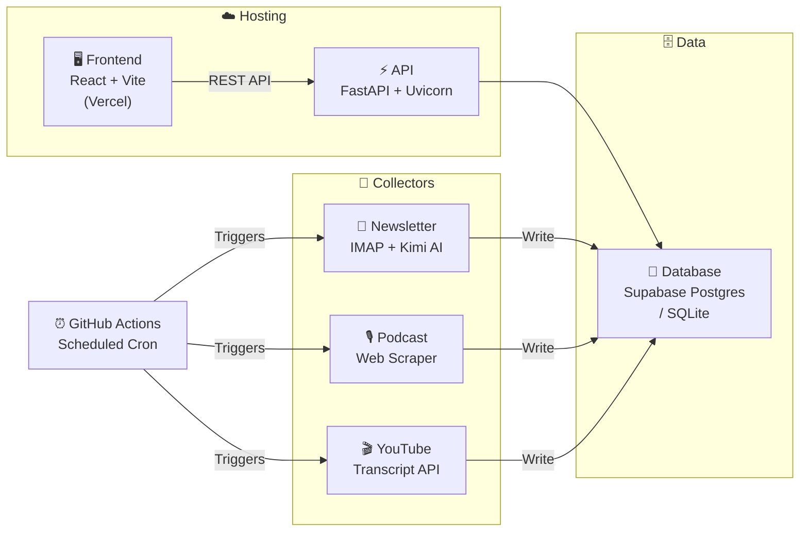

<](LICENSE)
[](https://python.org)
[](https://react.dev)
[](https://vercel.com)

---

_Automated sponsorship intelligence — from raw data to actionable insight._

</div>

## ✨ Features

| | Feature | Description |
|---|---|---|
| 📧 | **Newsletter Collector** | Ingests newsletters via IMAP and extracts sponsor mentions using AI |
| 🎙️ | **Podcast Collector** | Scrapes podcast directories for sponsorship data |
| 🎬 | **YouTube Collector** | Analyzes YouTube video transcripts for sponsor segments |
| 🤖 | **Kimi AI Integration** | Uses Moonshot AI (with OpenAI fallback) to parse & classify sponsors |
| 🌙 | **Premium Dark Dashboard** | React + Tailwind CSS frontend with rich filtering & search |
| ⚙️ | **GitHub Actions Automation** | Scheduled scraping workflows — set it and forget it |
| 🐘 | **Supabase / SQLite** | Production Postgres via Supabase, local SQLite for development |

---

## 🏗️ Architecture



---

## 🚀 Quick Start

### Prerequisites

- **Python 3.11+**
- **Node.js 18+**
- A [Moonshot AI](https://platform.moonshot.cn) API key (or OpenAI-compatible key)

### 1. Clone & configure

```bash
git clone https://github.com/your-username/SponsorFlow.git
cd SponsorFlow

cp .env.example .env
# ✏️  Fill in your API keys and email credentials in .env
```

### 2. Backend

```bash
python -m venv .venv
source .venv/bin/activate        # Windows: .venv\Scripts\activate
pip install -r requirements.txt

python server.py                 # → API running at http://localhost:8000
```

### 3. Frontend

```bash
npm install
npm run dev                      # → Dashboard at http://localhost:5173
```

### 4. Run collectors manually (optional)

```bash
python parser.py                 # Newsletter sponsor extraction
python podcast_collector.py      # Podcast sponsor scraping
python youtube_collector.py      # YouTube transcript analysis
```

---

## ☁️ Deployment

SponsorFlow is designed to run entirely on **free tiers**:

| Component | Service | Tier |
|---|---|---|
| 🖥️ Frontend | [Vercel](https://vercel.com) | Free |
| 🐘 Database | [Supabase](https://supabase.com) | Free (500 MB) |
| ⏰ Scrapers | [GitHub Actions](https://github.com/features/actions) | Free (2,000 min/mo) |

### Deploy steps

1. **Database** — Create a Supabase project, run `schema.sql` in the SQL editor, copy the connection string to `SUPABASE_DB_URL`.
2. **Frontend** — Connect the repo to Vercel. Set the build command to `npm run build` and output directory to `dist`.
3. **Scrapers** — Add your secrets (`MOONSHOT_API_KEY`, `IMAP_EMAIL`, etc.) to the repo's GitHub Settings → Secrets. The `.github/workflows/scrape.yml` cron will handle the rest.

---

## 📁 Project Structure

```
SponsorFlow/
├── .github/
│   └── workflows/
│       └── scrape.yml           # Scheduled GitHub Actions workflow
├── src/
│   ├── App.jsx                  # Main React dashboard component
│   ├── main.jsx                 # React entry point
│   └── index.css                # Tailwind CSS styles
├── config.py                    # Environment variable loader
├── database.py                  # Database abstraction (Supabase / SQLite)
├── parser.py                    # Newsletter email parser + AI extraction
├── podcast_collector.py         # Podcast sponsorship scraper
├── youtube_collector.py         # YouTube transcript sponsor detector
├── server.py                    # FastAPI backend server
├── schema.sql                   # Database schema (PostgreSQL)
├── index.html                   # Vite HTML entry
├── package.json                 # Frontend dependencies
├── requirements.txt             # Python dependencies
├── vite.config.js               # Vite configuration
├── tailwind.config.js           # Tailwind CSS configuration
├── postcss.config.js            # PostCSS configuration
├── .env.example                 # Environment variable template
└── .gitignore                   # Git ignore rules
```

---

## 🛠️ Tech Stack

- **Backend:** Python · FastAPI · Uvicorn
- **AI:** Moonshot AI (Kimi) · OpenAI-compatible SDK
- **Frontend:** React 18 · Vite · Tailwind CSS · Lucide Icons
- **Database:** PostgreSQL (Supabase) · SQLite (local dev)
- **Automation:** GitHub Actions · Cron scheduling
- **Scraping:** BeautifulSoup · youtube-transcript-api · IMAP

---

## 📄 License

This project is licensed under the **MIT License** — see the [LICENSE](LICENSE) file for details.

---

<div align="center">
  <sub>Built with ☕ and curiosity · <a href="https://sponsorflow.io">sponsorflow.io</a></sub>
</div>
]]>
